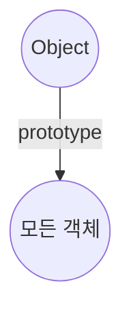

# Javascript의 자료형
{: .notice}


# primitive type
var bool = true;
var num = 1.1;
var str = "hello";

# reference type
var arr = [1,2,3];
var obj = {'a':1};

# other
var nul = null;
var undefi = undefined;



여기서 중요한 것은 기본 자료형 조차 객체처럼 사용할 수 있다는 것.
*각 기본 자료형도 객체 내부의 property 및 method를 갖고 있다.*

