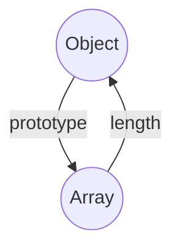

# Javascript의 자료형

## 실제론 예약어이기에 사용금지!

# primitive type
var boolean = true;
var number = 1.1;
var string = "hello";

# reference type
var arraray = [1,2,3];
var object = {'a':1};

# other
var null = null;
var undefined = undefined;



## 자료형은 외울 것도 없다! 논리연산하는 boolean, 숫자, 글자. 그리고 이 자료를 담는 그릇인 Object, Array 
### 여기서 중요한 것은 기본 자료형 조차 객체처럼 사용할 수 있다는 것.
**각 기본 자료형도 객체 내부의 property 및 method를 갖고 있다.**
**자료형을 확인하기 위해선 typeof를 내부함수를 활용하면 된다**

그럼 **primitive**,**reference** 그리고 **other** type의 차이점은 무엇일까?
{: .notice}

### primitive type은 call by value
### reference type은 call by reference
### other 타입은 그 어떤 연산도 할 수 없다는 것!
### 쉽게 말하면 값이냐 단지 그 이름만 빌려다가 쓰느냐 그 차이다.


# primitive type

var value = 100;
var reference = {'value':100};

var changeValue = function(value,reference){
var value = 200;
var reference.value = 200;
console.log(value);
console.log(reference.value);
}

changeValue(value,reference);
value === 200 # false
reference.value === 200 # true



**그럼 null과 undefined의 차이는?**
{: .notice}


# primitive type

var null = null;
var undefined = undefined;
typeof null === "object" #true
typeof undefined === "undefined" #true


## 그리고 Array의 prototype(부모 클래스라고 이해하면 쉬움)은 Object이다.
## Object에 length라는 property를 만들면 유사배열객체가 되어 apply 함수를 통해서 Array의 메소드를 사용할 수 있다!

