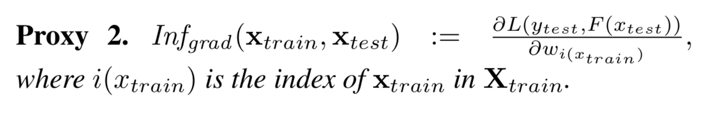

# Ensemble

DRF, xgboost, lightgbm, catboost 등은 트리를 이용한 ensemble 모델들이다.

이들 모델들은 kaggle이나 현업에서 가장 많이 쓰이는 모델이다.

그러나, 위 모델을 쓰는 것도 중요하지만 ensemble 모델이기에 해석이 어려웠고,

머신러닝 해석에 대한 연구가 많이 이뤄지게 됐다.


## Machine Learning Interbility

머신러닝 모델, 특히 위의 언급한 모델들을 해석하기 위한 기법이 4개 정도가 있다.

1. feature importance
2. shap , lime 등 mli 기법
3. object importance
4. feature plotting


그 중에서 object importance에 대해 정리하고자 한다.


## Object Importance

Object Importance는 trainset으로부터 test or valid set의 optimized metric에 대한 영향도를 측정하는 것이다.

[object_importance](https://arxiv.org/pdf/1802.06640.pdf)

링크에 실린 논문에서 자세한 내용을 알 수 있다.

## catboost에서 활용방법


``` python

from catboost import CatBoost

model = CatBoost(...,loss_function='RMSE')
model.fit(train_pool)

incides, scores = model.get_object_importance(
    validation_pool_sampled,
    train_pool_noisy,
    type = "Average",
    importance_values_sign='Positive'
)

```
코드는 위와 같이 사용하면 된다.

그런데, scores는 무엇을 의미하는 것일까?
간단하게 설명하자면, train set으로부터 valid set를 통해 측정한 optimized metric : RMSE에 대한 object importance 측정값이다.
> type : Average 이므로 valid set의 scores의 평균이다.

## 해석하는 방법



어려울 수 있지만, 해석하는 건 간단하다.
식을 통해 유추할 수 있듯이
> RMSE와 같이 작으면 좋은 metric에 대해선 양의 기울기를 갖고있으면 *성능이 안 좋아진다*는 의미이기 때문에 모델성능에 악영향을 끼치는 것
> 
> 역으로 음수영향을 끼친 다는 것는 성능이 좋아진다는 것이다.
> 
> 즉, importance_values_sign에서 positive로 return받는 값들은 모델에 영향을 안 좋게 끼치는 **데이터**들이다.  catboost에서는 sort한 후 return한다.

## 결론,

위의 코드를 통해 train set에서 어떤 데이터가 모델에 안 좋은 영향을 끼치는 지 알 수 있고,
위의 데이터에 대해 더 깊이 고찰하고 분석한다면 더 좋은 모델링을 기대할 수 있는 것이다(해당 데이터들을 어느 정도 제외하면 좋은 성능이 나올 것이라 기대할 수 있다.)

# Sample

아래 링크의 예제를 통해 공부할 수 있다.

[notebook](https://github.com/catboost/tutorials/blob/master/model_analysis/object_importance_tutorial.ipynb)