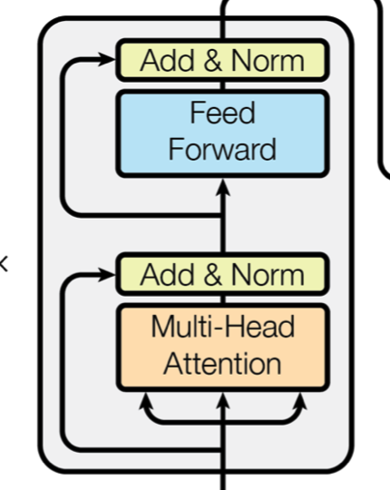
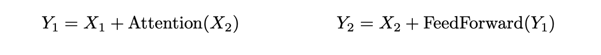
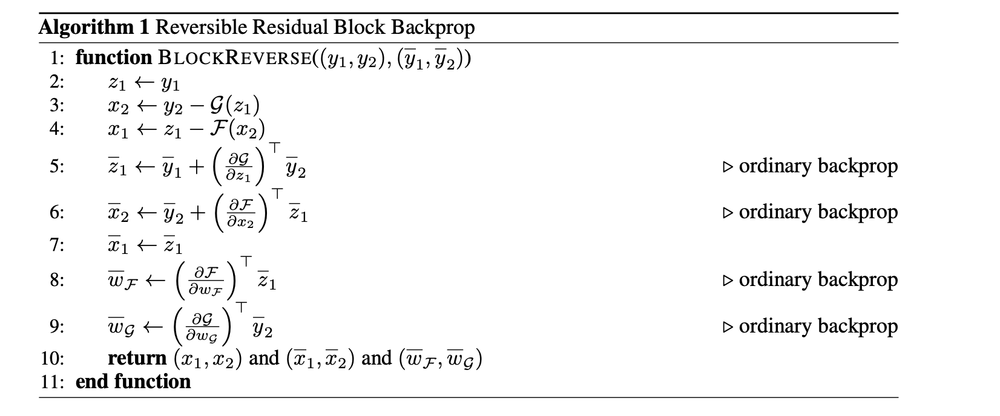

---  
layout: post  
title:  "Reformer 뽀개기 (저리가! Transformer) Part2"  
date:   2020-03-14
excerpt: ""  
tag:  
- Deep Learning  
- Natural Language Process  
- reformer

comments: false  
---  

# Reformer 뽀개기 (저리가! Transformer) Part 2


## Reversible Residual Network

Reversible Redisual Network는 결론적으로 memory 크기에 효율성을 가져오기 위해 도입된다.

그럼 도입되기 전후로 Transformer / Reformer를 비교해보자.

### Transformer



### Page 6

Even worse: inside the feed-forward layers of Transformer this goes up to b · l · dff · nl. In a big Transformer it is usual to set dff = 4K and nl = 16 so with l = 64K this again would use an impractical 16GB of memory

> Transformer에서 다른 parameter가 모두 동일하다고 가정하고 Deep한 모델을 만들기 위하여 layer의 개수를 늘린다고 해보자. 결국 파라미터는 nl의 비례하여 커지고, 만약 Big-Transformer로 설계한 경우 dff(4000) * nl(16) * l(64000) * 4(float32) = 16GB 메모리 크기가 16GB가 된다.

### Reformer

Reformer의 경우 Reversible Residual Network를 도입하여 nl에 대한 memory cost를 무시하게 된다.


Reversible Residual Network의 아이디어는 간단하다.

만약 어떤 activations에 대하여 backpropagation을 계산한다면, 거꾸로(Reversible) 계산하면 된다는 이야기다.



Y1이 X1 + Attention(X2)라고 하고, Y2 = X2 + FeedForward(Y1)이라고 해보자.

결국 backpropagation을 위해서 계산해야 할 것은 **X2 = Y2 - FeedForward(Y1) , X1 = Y1 - Attention(X2)** 위와 같이 역으로 계산하기만 하면 된다. 또잉? 너무 쉬워서 처음에 너무 당혹스러울 것이다. 미분이고 뭐고 필요없고, backprogapation을 직접 정의하여 계산하면 되는거다. 

```python
//https://github.com/Debian/tensorflow/blob/master/tensorflow/contrib/eager/python/examples/revnet/blocks.py
  
with tf.GradientTape(persistent=True) as tape:
      y = tf.identity(y)
      tape.watch(y)
      y1, y2 = tf.split(y, num_or_size_splits=2, axis=self.axis)
      z1 = y1
      gz1 = self.g(z1, training=training)
      x2 = y2 - gz1
      fx2 = self.f(x2, training=training)
      x1 = z1 - fx2
```

기존에 forward 혹은 call만 정의하면 가능한 layer 혹은 model에 대해서 대신 직접 정의해야 한다는 단점이 있다.

위 부분은 모든 memory에 대한 차지를 무시하는 것이 아니라 nl에 대한 term만 무시하게끔 설계되는데,


결국 nl만큼 attention과 feedforward는 반복된다고 할 때, nl만큼 반복되더라도 거꾸로 계산된 것을 backpropgation의 input으로 받아, 이전 Layer에 대한 backpropagation을 계산하고, ... 위 작업이 반복되면 결국 반복되는 reversible layer에 대한 memory 차지를 고려할 필요가 없게 된다.

그러나, 그만큼 연산량은 늘어나게 된다.



먼저 기존 backpropagation의 경우 N개의 connection을 가진다고 가정했을 때 forward 연산에서 N, backpropagation에서 gradient 계산과 update까지 들어가 2N이 되어 총 3N의 연산량이 필요하다.

그러나, reversible residual network의 경우 backward 부분에서 forward연산에 사용했던 residual function을 다시 계산해야 하므로, N만큼의 연산량이 추가되어 3N + N 즉, 4N만큼의 연산량이 필요하다.

그러면 Reversible 구조에서 모든 함수가 residual function으로 사용가능할까? 당연히 아니다.

### Reversible Residual Network Page 4

In general, a practical architecture would likely also include non-reversible layers, such as subsampling layers; the inputs to these layers would need to be stored explicitly during backprop.

> 원본 데이터가 복구될 수 없는 (환원할 수 없는) function의 경우 reversible residual network에서 사용할 수 없다.

### Page 6

Chunking. While reversibility covers the nl term, the thicker layers can still use a lot of memory. The feed-forward layer in particular can use intermediate vectors of dimensionality dff = 4K or higher. However, computations in feed-forward layers are completely independent across positions in a sequence, so the computation can be split into c chunks

> feed-forward network 부분에서 chunking을 통해 memory에 대한 효율성을 갖게 된다. 
>
> 결국 가능한 것은 inpute들이 서로 position에 대해서 영향을 끼치는 요소가 없기 때문에, c개만큼으로 chunk한다는 것이다.
