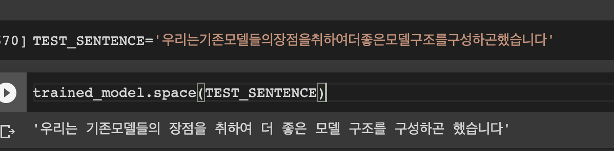
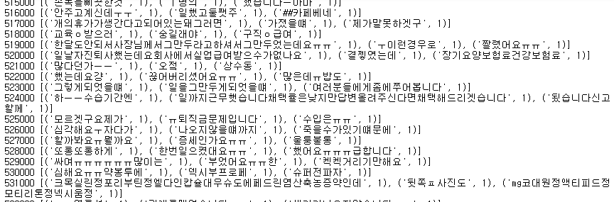
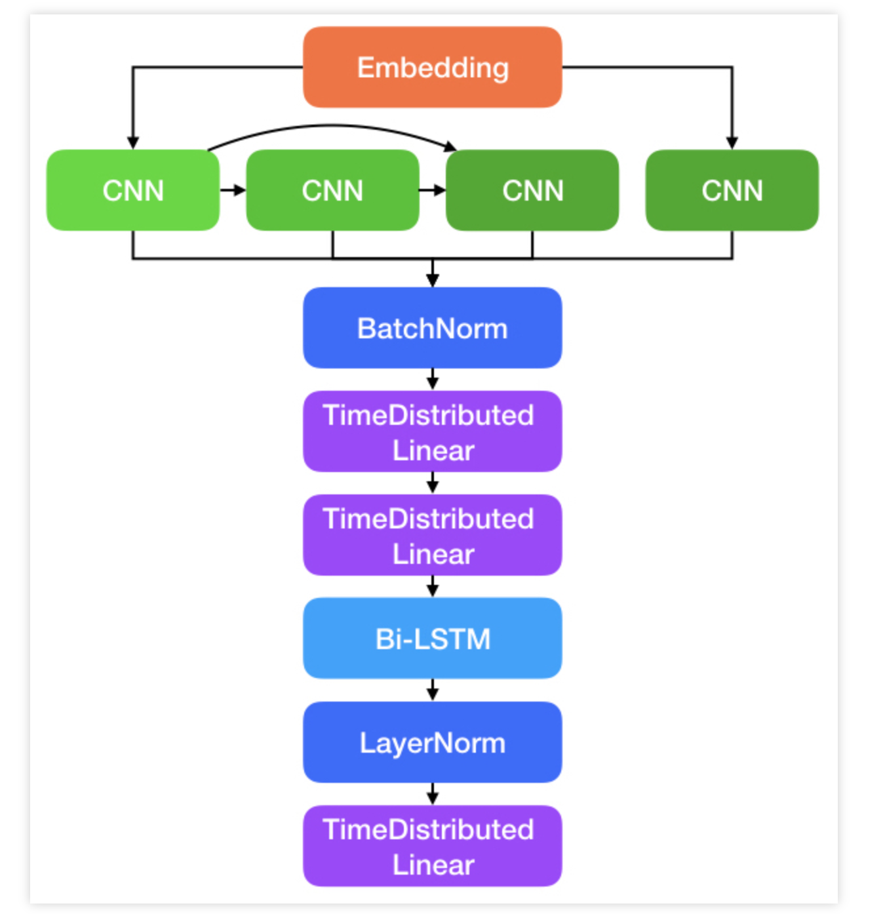
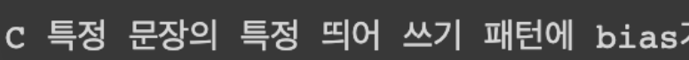
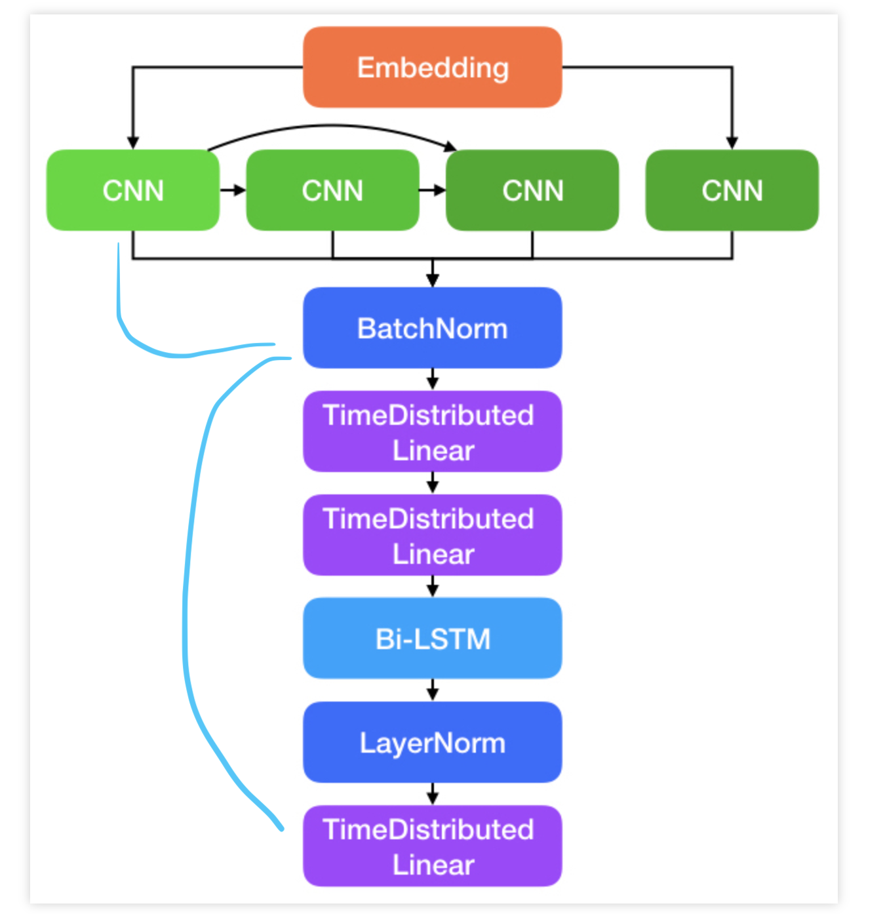
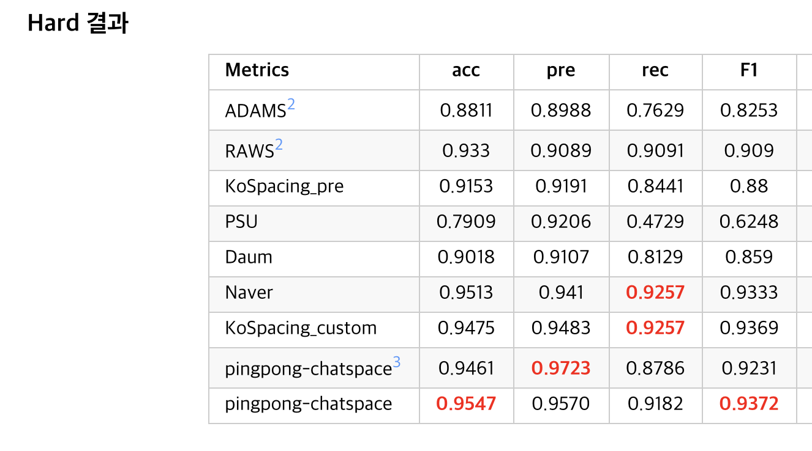
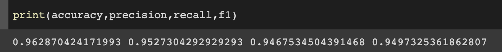

---  
layout: post  
title:  "띄어쓰기 봇을 만들어보자"  
date:   2020-06-24
excerpt: ""  
tag:  
- Natural Language Process

comments: false  
---  

# 띄어쓰기 봇

Reformer와 ELECTRA를 계기로 시작된 프로젝트가 있다.
일명 koggingface라는 프로젝트다.
SOTA 모델들을 활용하여 QA task나 여러 task에서 leaderboard를 찍어보겠다는 프로젝트다.
현재 ELECTRA 모델을 만들고있는데, wiki, 지식인, 영화 자막 등을 가져와서 학습 데이터로 사용하고 있다.
그러면서 생기게 된 문제가 발생했다.
Corpus를 구축할 때 mecab 혹은 komoran을 사용하였는데,

위와 같이 분절되지 않고 한꺼번에 있는 경우가 발생했기 때문이다.

## 어떻게 해결할 수 있을까?

띄어쓰기에 대해서 조사하던 중 반가운 레포를 확인하였다.
핑퐁에서 개발한 chatspace라는 레포였다.
[핑퐁 띄어쓰기](https://github.com/pingpong-ai/chatspace)

너무 재미있어 보여서, 해당 프로젝트를 기반으로 재미있는 연구를 한번 해보자 생각했다.

핑퐁의 모델은 다음과 같다.

CNN 필터를 기반으로 글자단위로 특징을 뽑아내고, 각 feature들에 대해서 함수(linear * 2)를 적용한 후
Bi-directional LSTM을 적용하여 시퀀스를 뽑는다는 것이다.

## Self Attention 적용

먼저 LSTM layer 대신에 self attention을 적용해보았다.
그리고 나서 결론은 이렇다.

**"무엇에 대해서 Attend할 것인지는 띄어쓰기에 딱히 필요없다"**
한 문장에서 문장 내 의미론적인 관계를 찾아내는데 self attention이 필요할 수 있지만,
영화 대사에서는 특히 앞에 attention value가 쏠리는 경향이 많이 발생하였고,
결국 다음과 같이

첫 글자에 대해서 무조건 띄어지는 패턴이 발생하게 되었다.

그리고 학습 데이터에 대해서도 영화에서 

그 동안
그 리고
안.. 녕하세요

위와 같이 작성되어 있는 텍스트들을 발견하였다. (전체 문장 비중 내 40~50% 였다. )

## 그러면 어떻게 성능을 더 좋게 할 수 있을까?

접근하였던 방법은 다음과 같다.

1. 학습 데이터 조정 

2. sequence 말고 window_size 3의 latent features를 직접 활용

### 1. 학습 데이터 조정

영화 대사들에 대해서 모든 케이스를 다 처리할 수 없지만, 
보통 앞에서 띄어쓰고 자막을 만드는 경우를 많이 확인하여
두번째 위치의 공란일 때 10% 확률로 샘플링하여 corpus에 구성하였다.

즉, 어느정도 문장들을 손실하더라도, 앞에 띄어쓰는 오류패턴들을 덜 학습시키기 위해서다.
(처음에는 다 제거하였는데, 모델은 이걸 보고 또 첫 시퀀스에 대해서는 무조건 붙이는 경향을 만들었다. )

### 2. window_size : 3의 latent faetures를 직접 활용

잘 생각해보면, 띄어쓰기에 과연 의미론적 관계를 파악하는게 중요할까? 
각 글자단위의 latent features에 대한 sequence를 활용하긴 하나,
마지막 linear layer에 window 내 text를 직접 반영할 수 있도록 window 3의 CNN을 직접 마지막 layer로 붙였다.

그러면 모델 아키텍처는 다음과 같아진다.

## 결과 

핑퐁의 hard 데이터셋 기준 score는 다음과 같았다.

그리고 위 구조로 학습셋 (100만 문장)만으로 학습하였을 떄 위와 같은 스코어가 나왔다.

히히 신난당 ㅎㅎ
