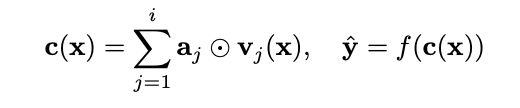

---  
layout: post  
title:  "Uncertainty-Aware Attention"  
date:   2020-06-26
excerpt: ""  
tag:  
- Deep Learning
- Bayesian Neural Network

comments: false  
---  

# Uncertainty-Aware Attention

Attention은 컴퓨터비전, 자연어처리 Task들의 문제를 푸는데 대단히 성공적이다.

Input에 대해서 Attention-value를 구함으로써 Input에 대해서 어떤 것에 대해 더 Attend할 지 구함으로써 
Input-Adaptive한 방식으로 features에 대해서 가중치를 구할 수 있으며, 위 방식으로 구한 모델은 대개 높은 Accuracy를 가지며, Interpretable하다.

그러나 많은 문제에서 Accuracy 보다 precision 혹은 Recall이 중요한 metric일 경우가 많은데 그 중 healthcare에선 Recall이 중요하다. 실제 암환자에 대해서 아니라고 하는 것이 더 위험하기 때문이다.

그렇다면 비록 Interpretable하더라도 Attention은 과연 신뢰할 수 있는가? 즉, 잘 아는 것에 대해선 잘 안다고 (low variance), 잘 모르는 것에 대해서 예측을 멈출 수 있는가? (I don't know)

기존 Attention은 확정적 모델이다. 즉, uncertainty를 구할 수 없으므로 위 물음에 대해 답할 수 없다.

위에 대한 문제를 해결하고자 위 논문의 저자는 Uncertainty-Aware Attention을 도입하게 되었고, 접근한 방법으로는 다음과 같다.

1. **Introducing stochastic attention mechanism**
    - stochastic approach를 통해 uncertainty를 구한다.
2. **Input-dependent attention weights**
    - 1을 확장하여 Input-dependent한 Gaussian Distribution을 따르는 attention weights를 구함으로써 instance에 따른 uncertainty를 구할 수 있게 한다.

## 1. **Introducing** stochastic attention mechanism

여기서 aj는 베르누이 분포을 따르게 되는데, 위에 학습할 땐 the evidence lower bound (ELBO)를 maximize하는 방법으로 구하게 된다.

그러나 위 분포를 통해서 generating하는 attention-value는 standard deviation가 0.5보다 클 수가 없으며,

Instance에 따른 uncertainty를 구할 수 없는 문제점을 갖게 된다.

### 2. **Input-dependent attention weights**

위의 문제점들을 해결하고자 먼저 attention-strength와 uncertatinty를 분리였는데,

sqaushing하기 전 attention-score(z)를 generate할 때 Input-dependent**(X 텀이 고려된)**한 조건부 확률을 통해서 score를 생성한다. 

score-strength는 **µ,** uncertainty**는 𝛔**를 따라가는 Input-dependent한 조건부 확률의 Gaussian Distribution으로 생성한다.

결론적으로, model parameter 자체를 random-variable로 취급하지만 위를 통해서 생성되는 attention-score는 각기 다른 Instance(**x에 따라**)에 대해 uncertainty를 구할 수 있게 된다.

그러나, 우리가 관심있는 p(Z, ω|D)의 경우 Marginal Probability(**P(D)**)에 대하여 features들끼리의 복잡한 구조를 띄고 있는 경우가 대부분이기에 계산자체가 어려울 수 있는데, 이를 위해 Approximation 방법으로 Variational Inference를 이용한다.

Monte-Carlo Sampling을 통해서 expectation을 근사하고, KL term에 대해서 dropout approxiamation과 근사분포와 실제분포에 대한 동일성의 가정을 이용하면 최종적으로 

위와 같은 objective를 갖게 된다.

위를 통해 학습한 이후 예측하는 단계에서도 dropout에 따른 parameter를 sampling한 후 Monte-Carlo Sampling을 통해 예측하게 된다. 즉, 예측하는 시점에서도 dropout하는 parameter에 따른 sampling의 결과에 따라 attention score(z)가 나오게 된다.

# 그러면 Uncertainty에 대해서 평가를 어떻게 할 수 있을까?

위 논문에서는 Expectation Calibration Error라는 confidence와 confidence에 따른 정확성에 대한 차이를 절대값으로한 값을 평균으로 하여 기준을 구한다.

그 결과로 baseline이 되는 RETAIN-확정/확률 모델과 함께 Input-dependent의 여부에 따라 결과를 보였다.

UA(UA+)가 모두 baseline 모델보다 성능이 좋았고, Input-dependent한 모델링이 영향이 있다라는 것을 보여줬다.

본질적으로 위 모델을 통해서 확인하고자 했던 

잘 아는 것에 대해선 잘 안다고 (low variance), 잘 모르는 것에 대해서 high variance를 갖는 지를 feature별로 구하였다. 

실제 previous timestamp가 없는 urine이나 normal range에서 벗어나는 Heart Rate에 대해서는 **높은 분산**을 가진 반면, normal range내에서 cyclic change가 있는 SysABP나 DiasABP에 대해선 **낮은 분산**을 가진다.

예측 결과에서도 틀리는 것보다 I don't know로 예측하는 비율이 UA(UA+)이 baseline 모델보다 높은 것을 확인할 수 있다.

# 의문점

1. 만약 stochastic approach를 하는 게 의미가 있다면 baseline 모델인 RETAIN 모델에서도 같은 결과를 보여야 할 것 같은데, 두 모델에서 왜 다른 결과가 있는지?
    - multinoulli distribution으로 모델링하였는데, distribution에 따라 성능이 차이가 난다면 데이터에 따라 모델링을 다르게 해야 하는건지?
2. 실제 healthcare에선 Recall이 중요한 metric인데, False Negative (Type 2 Error)가 높게 나오는 게 더 좋은 모델이라고 할 수 있을지?

