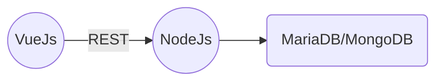

    

<h2>The best man</h2>

## Game
* The legend of Zelda, The Breath of The Wild
* Mario Odessay
* Hollow Night
* FIFA 18, difficulty : Legend
* Startcraft 1
* Uncharted 4

## Language
<h3 class="title" style="font-size:30px;">
<i class="devicon-java-plain" style="margin-left:20px;"></i>
<i class="devicon-python-plain" style="margin-left:20px;"></i>
<i class="devicon-javascript-plain" style="margin-left:20px;"></i>
<i class="devicon-cplusplus-plain" style="margin-left:20px;"></i>
</h3>

## Movie
* The Dark Knight
* How I Met Your Mother
* Oh, Captain, My Captain! 

